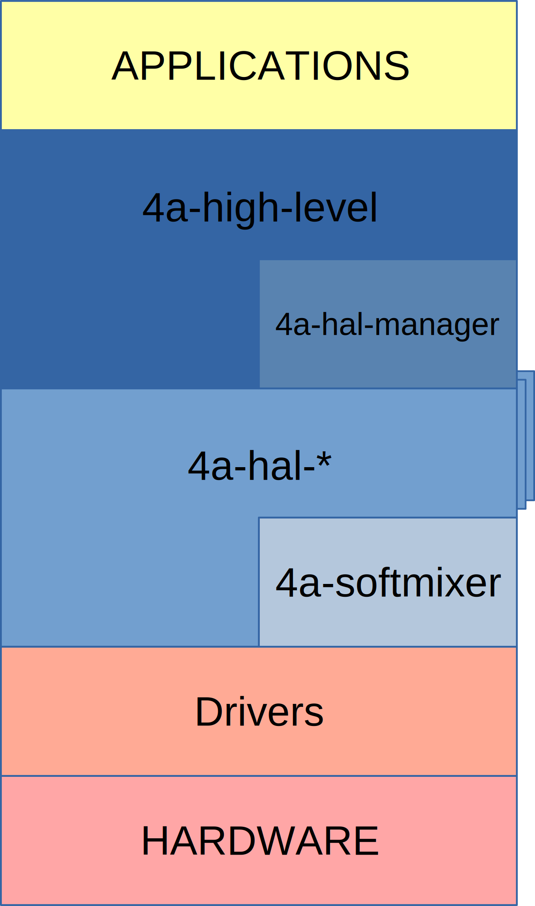

<!-- WARNING: This file is generated by fetch_docs.js using /home/boron/Documents/AGL/docs-webtemplate/site/_data/tocs/apis_services/flounder/flounder-agl-service-audio-4a-developer-guides-api-services-book.yml -->

# AGL Advanced Audio Architecture (4a)

## Abstract

4a is an audio framework made to handle automotive use cases like stream
priority and interruptions. It does **not** deal with the audio by itself but
rather with the policies and signaling around it. This means that 4a must be
used in conjunction with an other API that is in charge of the audio stuff,
like **alsa** or **pulseaudio**.

## Architecture

### Global architecture

This detailed diagram shows the interactions between all components.

This diagram shows the global architecture that any application playing audio
should follow. As a developer, when you want to play audio, you rely on APIs
such as alsa, pulseaudio or higher level API(s). To play audio you usually have
some kind of device URI that you have to open in order to write audio data to
it.

4a does **not** change anything about that. You still have to do all of this. 4a
provides permissions, signals and policies. This means that all compliant
applications have to ask 4a for a 'role' when they want to play audio. If 4a
grants them the permission, it returns a device URI that applications have to
open.

Nothing prevent an application to directly open a device, but in this case no
policies can be applied and access permissions are handled by system policies.

### 4a Architecture

Even if applications only deal with the high level API, 4a is made of multiple
components that rely on each other.

The high level API uses the hal-manager to list enabled HALs then it uses
directly those HALs.

HALs rely directly on drivers and/or softmixer.
