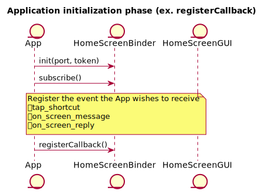
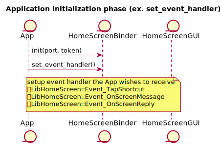
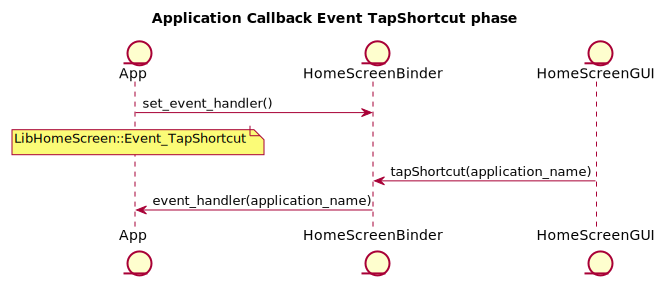

<!-- WARNING: This file is generated by fetch_docs.js using /home/boron/Documents/AGL/docs-webtemplate/site/_data/tocs/apis_services/flounder/flounder-agl-service-homescreen-developer-guides-api-services-book.yml -->

**HomeScreen GUI Application / HomeScreen Service Guide**
====
    Revision: 0.1
    TOYOTA MOTOR CORPORATION
    Advanced Driver Information Technology
    17th/June/2019

* * *

## Table of content
- [Target reader of this document](#target-reader-of-this-document)
- [Overview](#overview)
- [Getting Start](#getting-start)
    - [Supported environment](#supported-environment)
    - [Build](#build)
    - [Configuring](#configuring)
    - [How to call HomeScreen APIs from your Application?](#how-to-call-homescreen-apis-from-your-application)
- [Supported usecase](#supported-usecase)
- [Software Architecture](#software-architecture)
- [API reference](#api-reference)
- [Sequence](#sequence)
    - [Initialize](#initialize-sequence)
    - [Tap Shortcut(deprecated)](#tap-shortcut-sequence)
    - [On Screen Message / Reply Sequence](#on-screen-message-/-reply-sequence)
- [Sample code](#sample-code)
- [Limitation](#limitation)
- [Next Plan](#next-plan)
- [Appendix](#appendix)

* * *

## Target reader of this document
Application developer whose software uses HomeScreen.

* * *

## Overview
HomeScreen is built with a GUI application created with Qt(referred as HomeScreenGUI), and a service running on afb-daemon (referred as HomeScreenBinder).
HomeScreen can start/switch applications run in AGL, also displays information such as onscreen messages.

You can find these projects in AGL gerrit.

- [homescreen-2017(HomeScreenGUI)](https://gerrit.automotivelinux.org/gerrit/#/admin/projects/staging/homescreen-2017)
- [agl-service-homescreen-2017(HomeScreenBinder's binding library)](https://gerrit.automotivelinux.org/gerrit/#/admin/projects/apps/agl-service-homescreen-2017)
- [libhomescreen(library for application to communication with HomeScreenBinder)](https://gerrit.automotivelinux.org/gerrit/#/admin/projects/src/libhomescreen)

Also HomeScreenGUI is using libwindowmanager.

* * *

## Getting Start

### Supported environment

| Item        | Description                       |
|:------------|:----------------------------------|
| AGL version | Funky Flounder                      |
| Hardware    | Renesas R-Car Starter Kit Pro(M3) |


### Build

**Download recipe**

```
$ mkdir WORK
$ cd WORK
$ repo init -u https://gerrit.automotivelinux.org/gerrit/AGL/AGL-repo
$ repo sync

```

Then you can find the following recipes.

* `meta-agl-devel/meta-hmi-framework/homescreen-2017`

* `meta-agl-devel/meta-hmi-framework/agl-service-homescreen-2017`

* `meta-agl-demo/recipes-demo-hmi/libhomescreen`


**Bitbake**

```
$ source meta-agl/scripts/aglsetup.sh -m m3ulcb agl-demo agl-devel agl-appfw-smack agl-hmi-framework
$ bitbake agl-demo-platform
```

### Configuring
To use HomeScreen API, an application shall paste the following configuration definition into "config.xml" of application.

```
<feature name="urn:AGL:widget:required-api">
	<param name="homescreen" value="ws" />
</feature>
```

### How to call HomeScreen APIs from your Application?
HomeScreen provides a library which is called "libhomescreen".
This library treats "json format" as API calling.
For example, if an application wants to call "tap_shortcut()" API, the you should implement as below.

At first the application should create the instance of libhomescreen.

```
LibHomeScreen* libhs;
libhs = new LibHomeScreen();
libhs->init(port, token);
```

The port and token is provided by Application Framework

Execute the "tapShortcut()" function.

```
libhs->tapShortcut("application_name");
```

Regarding the detail of tap_shortcut() API, please refer [this](#HomeScreen\ API) section.
The first parameter is the name of API, so in this case "tap_shortcut" is proper string.
And the second parameter corresponds to arguments of "connect()" API.

See also our [Sample code](#sample-code).

* * *

## Supported usecase
1. HomeScreenGUI sending ShortCut Icon tapped event to applications
	- Applications using libhomescreen to subscribe the tapShortcut event,
        HomeScreenGUI will send ShortCut Icon tapped event to applications.
2. Display OnScreen messages
	- Applications sending OnScreen messages to homescreen-service, and OnScreenAPP
        will get these message and display.
3. Get OnSreen Reply event
	- When OnScreen messages is displaying, OnScreenAPP will send a reply event to applications.

* * *

## Software Architecture
The architecture of HomeScreen is shown below.
HomeScreen is the service designed to be used by multiple applications.
Therefore HomeScreen framework consists on two binder layers. Please refer the following figure.
The upper binder is for application side security context for applications. The lower binder is for servide side security context.
Usually application side binder has some business logic for each application, so the number of binders depend on the number of applications which use HomeScreen.
On the other hand, regarding lower binder there is only one module in the system. This binder receives all messages from multiple applications (in detail, it comes from upper layer binder).

The communication protocols between libhomescreen and upper binder, upper binder and lower binder, lower binder (homescreen-binding) are WebSocket.


* * *

## API reference
"libhomescreen" and "agl-service-homescreen-2017" provides several kinds of APIs.

### HomeScreen Specific API

- LibHomeScreen::init (const int port, const std::string &token)
```
    port [in] : This argument should be specified to the port number to be used for websocket
    token [in] : This argument should be specified to the token to be used for websocket

    Create connection to homescreen-service by port and token which provided by
    application framework. This API must be called before calling other api.
```
- LibHomeScreen::tapShortcut(const char *application_name)
```
    application_name [in] : Tapped application name (label)

    Request to show the window of application_name.
```
- LibHomeScreen::onScreenMessage(const char *display_message)
```
    display_message [in] : message for display

    Request to display message in onscreen.
```
- LibHomeScreen::onScreenReply(const char *reply_message)
```
    reply_message [in] : message for reply

    Post reply message to application.
```
- LibHomeScreen::registerCallback(void(*event_cb)(const std::string &event, struct json_object *event_contents), void(*reply_cb)(struct json_object *reply_contents), void(*hangup_cb)(void)=nullptr)
```
    event_cb [in] : This argument should be specified to the callback for subscribed event
    reply_cb [in] : This argument should be specified to the reply callback for call function
    hangup_cb [in] : This argument should be specified to the hangup callback for call function

    This api is deprecated, recommend using set_event_handler.
```
- LibHomeScreen::set_event_handler(enum EventType et, handler_func f)
```
    et [in] : event name
    f [in] : event handler

    Setting event handler for Homescreen-Service Event.
```
- LibHomeScreen::call(const string& verb, struct json_object* arg)
- LibHomeScreen::call(const char* verb, struct json_object* arg)
```
    verb [in] : This argument should be specified to the API name (e.g. "tap_shortcut")
    arg [in] : This argument should be specified to the argument of API.
    And this argument expects JSON object

    Call homescreen-service verb.
```
- LibHomeScreen::subscribe(const string& event_name)
```
    event_name [in] : This argument should be specified to the event name

    Subscribe homescreen-service event. Deprecated, recommend using set_event_handler.
```
- LibHomeScreen::unsubscribe(const string& event_name)
```
    event_name [in] : This argument should be specified to the event name

    Unsubscribe homescreen-service event. Deprecated, recommend using set_event_handler.
```

* * *

## Sequence

### Initialize Sequence
 * deprecated


### Tap Shortcut Sequence


### On Screen Message / Reply Sequence


## Sample code
You can find sample implementation of HomeScreen as below.

* `libhomescreen/sample/simple-egl`

* `libhomescreen/sample/template`

* * *

## Limitation
None.

* * *

## Next Plan
None.

* * *

## Appendix

```
@startuml
title Application initialization phase (ex. registerCallback)
entity App
entity HomeScreenBinder
entity HomeScreenGUI
App->HomeScreenBinder: init(port, token)
App->HomeScreenBinder: subscribe()

note over HomeScreenBinder
    Register the event the App wishes to receive
    ・tap_shortcut
    ・on_screen_message
    ・on_screen_reply
end note

App->HomeScreenBinder: registerCallback()

@enduml
```

```
@startuml
title Application initialization phase (ex. set_event_handler)
entity App
entity HomeScreenBinder
entity HomeScreenGUI
App->HomeScreenBinder: init(port, token)
App->HomeScreenBinder: set_event_handler()

note over HomeScreenBinder
    setup event handler the App wishes to receive
    ・LibHomeScreen::Event_TapShortcut
    ・LibHomeScreen::Event_OnScreenMessage
    ・LibHomeScreen::Event_OnScreenReply
end note

@enduml
```

```
@startuml
title Application Callback Event TapShortcut phase
entity App
entity HomeScreenBinder
entity HomeScreenGUI
App->HomeScreenBinder: set_event_handler()

note over App
    LibHomeScreen::Event_TapShortcut
end note

HomeScreenGUI->HomeScreenBinder: tapShortcut(application_name)
HomeScreenBinder->App: event_handler(application_name)
@enduml
```

```
@startuml
title Application Callback Event On Screen Message / Reply phase
entity App
entity HomeScreenBinder
entity HomeScreenGUI

HomeScreenGUI->HomeScreenBinder: set_event_handler()

note over HomeScreenGUI
    LibHomeScreen::Event_OnScreenMessage
end note


App->HomeScreenBinder: set_event_handler()

note over App
    LibHomeScreen::Event_OnScreenReply
end note

App->HomeScreenBinder: onScreenMessage(display_message)
HomeScreenBinder->HomeScreenGUI: event_handler(display_message)
HomeScreenGUI->HomeScreenBinder: onScreenReply(reply_message)
HomeScreenBinder->App: event_handler(reply_message)
@enduml
```
